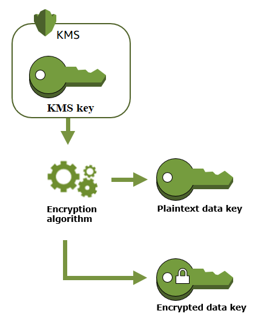
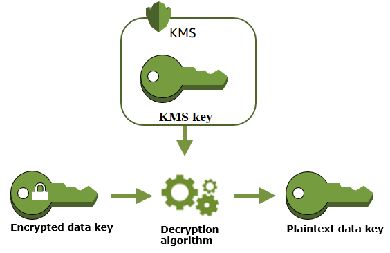

# AWS Key Management Service(KMS) 란?

AWS Key Management Service(이하 KMS)는 데이터를 암호화하는 데 사용하는 암호화 키를 쉽게 생성하고 제어할 수 있게 해주는 관리형 서비스입니다.

AWS KMS는 데이터를 암호화하는 대부분의 AWS서비스와 통합됩니다.
그리고, AWS KMS는 감사, 규제, 규정 준수 요구사항에 따라 KMS키 사용을 기록하기 위해 AWS cloudTrail과 통합됩니다.


## AWS KMS 용어
KMS암호화과정을 알기 위해서는 먼저 기본적인 KMS 용어에 대해 알고 있어야 합니다.


### KMS KEY
KMS키를 사용해 데이터를 암복호화 할 수 있습니다. 일반적으로 대칭키를 사용하며, 암호화/서명에 비대칭 KMS키를 만들고 사용할 수 있습니다.

> **대칭 KMS KEY**<br>
> 대칭 KMS 키는 256비트 암호화키를 나타냅니다. 대칭키를 사용하기 위해서는 반드시 KMS를 호출해야합니다. 대칭키는 대칭 암호화에 사용되며, 동일한
> 키가 암호화 및 복호화에 사용됩니다.<br>
> **비대칭 KMS KEY**<br>
> KMS에서 비대칭 KMS KEY 역시 생성할 수 있는데요, 비대칭키는 퍼블릭키/프라이빗키 페어를 말합니다. 프라이빗키는 암호화되지 않은 상태로 KMS를 벗어날 수 없습니다. 별도로 프라이빗키를 사용하기 위해서는 AWS에 연락을 취해야합니다. 퍼블릭키는 AWS KMS API 작업을 호출하여 KMS내부 또는 퍼블릭키를 다운로드 하여 KMS 외부에서 사용할 수 있습니다.

### 데이터 키
다운로드 할 수 없는 KMS 키와 달리 데이터키는 AWS KMS 외부 사용용으로 반환됩니다. AWS KMS가 데이터키를 생성하는 경우 즉시 일반 텍스트 키(plaintext key)와 암호화된 복사본(encrypted key)를 반환합니다. 이때, 데이터키를 KMS는 저장, 관리 또는 추적하지 않습니다. 따라서, KMS 밖에서 데이터 키를 사용하고 관리해야합니다.


## AWS KMS 암호화 과정

### 1) 데이터 키 생성
먼저, 암호화를 하기 위해서 KMS를 통해 데이터 키를 생성합니다.
그리고 대칭 KMS key를 이용해 데이터 키의 복사본을 암호화합니다.



**aws-encryption-sdk-java-2.3.3-sources.jar 참조**

`com.amazonaws.encryptionsdk.kms.KmsMasterKey.class`
데이터 키 생성 로직

`new GeneratedDataKeyRequest()`를 통해 KMS KEY를 이용하여 데이터키를 생성합니다.

```java

@Override
public DataKey<KmsMasterKey> generateDataKey(
    final CryptoAlgorithm algorithm, final Map<String, String> encryptionContext) {
  final GenerateDataKeyResult gdkResult =
      kms_.get()
          .generateDataKey(
              updateUserAgent(
                  new GenerateDataKeyRequest()
                      .withKeyId(getKeyId())
                      .withNumberOfBytes(algorithm.getDataKeyLength())
                      .withEncryptionContext(encryptionContext)
                      .withGrantTokens(grantTokens_)
		)
	   );
		      
  final byte[] rawKey = new byte[algorithm.getDataKeyLength()];
  gdkResult.getPlaintext().get(rawKey);
  
  if (gdkResult.getPlaintext().remaining() > 0) {
    throw new IllegalStateException("Recieved an unexpected number of bytes from KMS");
  }
  
  final byte[] encryptedKey = new byte[gdkResult.getCiphertextBlob().remaining()];
  gdkResult.getCiphertextBlob().get(encryptedKey);

  final SecretKeySpec key = new SecretKeySpec(rawKey, algorithm.getDataKeyAlgo());
  
  return new DataKey<>(key, encryptedKey, gdkResult.getKeyId().getBytes(StandardCharsets.UTF_8), this);
}

```

### 2) 데이터 키로 데이터 암호화
AWS KMS는 데이터 키를 사용하여 데이터를 암호화할 수 없습니다. 하지만 OpenSSL 또는  [AWS Encryption SDK](https://docs.aws.amazon.com/encryption-sdk/latest/developer-guide/)  같은 암호화 라이브러리를 사용하여 AWS KMS 외부에서 데이터 키를 사용할 수 있습니다.
(이 글 하단에서 AWS Encryption SDK Java를 이용하여 암호화하는 법을 안내합니다.)

일반 텍스트(plaintext) 데이터 키를 이용하여 데이터를 암호화한 후, 암호화된 데이터 키와 암호화된 데이터를 함께 안전하게 저장합니다(DB에 저장되는 데이터 = 암호화된 데이터 + 암호화된 데이터키). 이때, 암호화된 데이터 키는 데이터 복호화할 때 사용됩니다.


#### 암호화 관련 Errors
- *DependencyTimeoutException*
- *DisabledException*
- *InvalidGrantTokenException*
- *InvalidKeyUsageException*
- *KeyUnavailableException*
- *KMSInternalException*
- *KMSInvalidStateException*
- *NotFoundException*

자세한 Error 내용은 하기 URL 참고 부탁드립니다.
[Encrypt - AWS Key Management Service](https://docs.aws.amazon.com/kms/latest/APIReference/API_Encrypt.html)

**aws-encryption-sdk-java-2.3.3-sources.jar 참조**
데이터 키로 데이터 암호화는  `AwsCrypto.class encryptData()`에서 수행됩니다.

```java

... 생략
public CryptoResult<byte[], ?> encryptData(
    CryptoMaterialsManager materialsManager,
    final byte[] plaintext,
    final Map<String, String> encryptionContext) {
  
  EncryptionMaterialsRequest request = EncryptionMaterialsRequest.newBuilder()
          .setContext(encryptionContext)
          .setRequestedAlgorithm(getEncryptionAlgorithm())
          .setPlaintext(plaintext)
          .setCommitmentPolicy(commitmentPolicy_)
          .build();

  // encryptionMaterials는 masterKey, plaintext key, encrypted key 모두 가지고 있습니다. 해당 키들을 활용하여 데이터를 암호화합니다.
  EncryptionMaterials encryptionMaterials = checkMaxEncryptedDataKeys(checkAlgorithm(materialsManager.getMaterialsForEncrypt(request)));
  
  final MessageCryptoHandler cryptoHandler = new EncryptionHandler(getEncryptionFrameSize(), encryptionMaterials, commitmentPolicy_);

  final int outSizeEstimate = cryptoHandler.estimateOutputSize(plaintext.length);
  final byte[] out = new byte[outSizeEstimate];
  int outLen = cryptoHandler.processBytes(plaintext, 0, plaintext.length, out, 0).getBytesWritten();
  outLen += cryptoHandler.doFinal(out, outLen);

  final byte[] outBytes = Utils.truncate(out, outLen);

  //noinspection unchecked
  return new CryptoResult(outBytes, cryptoHandler.getMasterKeys(), cryptoHandler.getHeaders());
}
...생략

```


### 3) 데이터 키로 데이터 복호화
데이터 암호화를 해제하려면 Decrypt 작업으로 암호화된 데이터키를 전달합니다. AWS KMS는 KMS 키를 사용하여 암호화된 데이터키를 복호화 한 후 일반 데이터키를 사용하여 암호화된 데이터를 복호화합니다.



#### 복호화 관련 Errors
- *DependencyTimeoutException*
- *DisabledException*
- *IncorrectKeyException*
- *InvalidCiphertextException*
- *InvalidGrantTokenException*
- *InvalidKeyUsageException*
- *KeyUnavailableException*
- *KMSInternalException*
- *KMSInvalidStateException*
- *NotFoundException*

자세한 Error 내용은 하기 URL 참고 부탁드립니다.
[Decrypt - AWS Key Management Service](https://docs.aws.amazon.com/kms/latest/APIReference/API_Decrypt.html)

**aws-encryption-sdk-java-2.3.3-sources.jar 참조**
데이터 복호화는 ` AwsCrypto.class decryptData()`에서 수행됩니다.

```java
public CryptoResult<byte[], ?> decryptData(
  final CryptoMaterialsManager materialsManager, 
  final ParsedCiphertext ciphertext) {
  
  Utils.assertNonNull(materialsManager, "materialsManager");

  final MessageCryptoHandler cryptoHandler =
      DecryptionHandler.create(
          materialsManager,
          ciphertext,
          commitmentPolicy_,
          SignaturePolicy.AllowEncryptAllowDecrypt,
          maxEncryptedDataKeys_);

  final byte[] ciphertextBytes = ciphertext.getCiphertext();
  final int contentLen = ciphertextBytes.length - ciphertext.getOffset();
  final int outSizeEstimate = cryptoHandler.estimateOutputSize(contentLen);
  final byte[] out = new byte[outSizeEstimate];
  final ProcessingSummary processed = cryptoHandler.processBytes(ciphertextBytes, ciphertext.getOffset(), contentLen, out, 0);
  
  if (processed.getBytesProcessed() != contentLen) {
    throw new BadCiphertextException("Unable to process entire ciphertext. May have trailing data.");
  }
  int outLen = processed.getBytesWritten();
  outLen += cryptoHandler.doFinal(out, outLen);

  final byte[] outBytes = Utils.truncate(out, outLen);

  //noinspection unchecked
  return new CryptoResult(outBytes, cryptoHandler.getMasterKeys(), cryptoHandler.getHeaders());
}

```

## AWS Encryption SDK Java를 활용한 암복호화

### AWS Encryption SDK?

AWS Encryption SDK는 클라이언트 암호화 라이브러리로 암복호화를 쉽게 할 수 있도록 도와줍니다.

`aws code example` 참고

### KMS 설정

```java
... 생략

@Component
public class AwsKmsProvider {

	@Value("${kms.keyarn}")
	private String kmsEncryptionKeyArn;

	private CryptoMaterialsManager cachingCmm;
	private AwsCrypto awsCrypto;

	@PostConstruct 
	public void init() {
    	// 1. Instantiate the SDK, awsCrypto은 데이터 암복호화를 수행합니다.
    	this.awsCrypto = AwsCrypto.builder()
		.withCommitmentPolicy(CommitmentPolicy
		.RequireEncryptRequireDecrypt)
            	.withEncryptionAlgorithm(CryptoAlgorithm.ALG_AES_256_GCM_HKDF_SHA512_COMMIT_KEY) // 암호화 알고리즘 설정
		.build();
	  
    	// 2. KMS Key 설정
    	KmsMasterKeyProvider keyProvider = KmsMasterKeyProvider.builder()
		.buildStrict(this.kmsEncryptionKeyArn);

    	// 3. Create a key material cache.
    	CryptoMaterialsCache cache = new LocalCryptoMaterialsCache(100);

    	// 4. Create a caching CMM.
    	// KMS Key를 저장하여 호출 횟수를 줄여주고 비용/성능 관리를 도와줍니다.
    	this.cachingCmm = CachingCryptoMaterialsManager
            .newBuilder()
            .withMasterKeyProvider(keyProvider)
            .withCache(cache) // LRU캐
            .withMaxAge(3600, TimeUnit.MILLISECONDS) 
            .build();

	}
}
```

### KMS 암호화
```java
public String encrypt(String plainText) {

    byte[] plainBytes = plainText.getBytes(StandardCharsets.UTF_8);
    byte[] encryptedBytes = awsCrypto.encryptData(cachingCmm, plainBytes).getResult();
    String encryptText = Base64.encodeAsString(encryptedBytes);
    return encryptText;
}

```

### KMS 복호화
```java
public String decrypt(String encryptText) {

    byte[] encryptBytes = Base64.decode(encryptText);
    byte[] decryptedBytes = awsCrypto.decryptData(cachingCmm, encryptBytes).getResult();
    String decryptText = new String(decryptedBytes, StandardCharsets.UTF_8);
    return decryptText;
}

```
